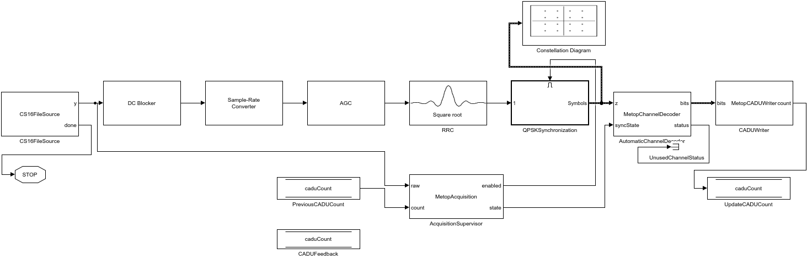

# Simulink MetOp AHRPT Receiver

The physical-layer stage of [MetOp AHRPT Receiver](../README.md). It reads a
recorded complex IQ stream, acquires and tracks QPSK, decodes the convolutional
channel code, and writes aligned **1024-byte CADUs** for the C++ decoder.

**Active model:** [`demodulator_metop_r.slx`](demodulator_metop_r.slx)

**Entry point:** `metop_ahrpt_run`

**Configured input rate:** 10 MHz complex samples

[Run](#run-a-recording) · [Pipeline](#receiver-pipeline) ·
[Block reference](#block-reference) · [Acquisition](#acquisition-and-reacquisition) ·
[Outputs](#outputs-and-next-stage) · [Tests](#tests-and-validation)

## Requirements and input

Tested with MATLAB/Simulink **R2024b Update 1**, Communications Toolbox,
DSP System Toolbox and a supported native C/C++ compiler. The compiler is used
by standard System blocks in code-generation simulation mode. The Simulink
Agentic Toolkit is an editing tool, not a dependency for running the receiver.

The input is a static, headerless `.cs16` file:

| Property | Required value |
| --- | --- |
| Sample representation | Signed, little-endian 16-bit integers |
| Component order | `I0, Q0, I1, Q1, ...` |
| Bytes per complex sample | 4 |
| Complex sample rate | **10,000,000 samples/s** |
| In-model representation | Complex `single`, both components divided by 32768 |

The file length must be divisible by four. A WAV file, complex-float recording,
byte-swapped IQ or different sample rate requires conversion/configuration before
this receiver can process it. The sample rate is part of the source, resampler
and spectral acquisition configuration; changing a carrier-loop setting does
not compensate for the wrong input rate.

## Run a recording

From the **repository root** in MATLAB:

```matlab
addpath('simulink')
result = metop_ahrpt_run("D:/captures/pass.cs16", "out/pass.cadu");
```

The default run starts at **t = 0**, reads once through EOF and stops itself.
There is no need to choose a favorable starting offset. Input IQ is never
modified. The output directory is created if needed; using the same output
filename again replaces the earlier CADU and run reports.

Without the second argument, output is `out/metop.cadu` relative to the repository.
Explicit relative paths resolve against MATLAB's current directory.

### Show the constellation

```matlab
result = metop_ahrpt_run("D:/captures/pass.cs16", "out/pass-visible.cadu", ...
    ShowScopes=true);
```

The single Constellation Diagram receives the **final synchronized QPSK symbols
directly**, from the same output used by the automatic channel decoder.
The model retains this scope; unattended runs disable it with the default
`ShowScopes=false`. A stationary four-cluster display alone does not prove
that the receiver is locked: use the resulting CADUs and the C++ RS statistics.

For interactive control of the simulation:

```matlab
[in,cfg] = metop_ahrpt_init("D:/captures/pass.cs16", ...
    "out/interactive.cadu", ShowScopes=true);
out = sim(in);
```

`metop_ahrpt_init` returns a `Simulink.SimulationInput`; it does not run the
model. `metop_ahrpt_run` also saves the compact run report after simulation.

### Run options

| Option | Default | Use |
| --- | --- | --- |
| `StartTimeSeconds` | `0` | Debug-only seek into the IQ recording. Normal operation starts at zero. |
| `StopTime` | `Inf` | Simulation time limit; the source's EOF signal stops normal runs. |
| `SoftDecision` | `true` | Unquantized soft input to Viterbi; `false` selects the hard-decision comparison path. |
| `ShowScopes` | `false` | Enable the one constellation display for interactive inspection. |
| `CacheFolder` | `out/slcache` | Isolate generated simulation/code products. |

For a short diagnostic window:

```matlab
result = metop_ahrpt_run("D:/captures/pass.cs16", "out/window.cadu", ...
    StartTimeSeconds=60, StopTime=2);
```

This two-second window starts at the 60-second file offset; it is not a substitute
for validating acquisition from t=0. For concurrent sessions, use separate
output paths and cache folders.

## Receiver pipeline

```text
CS16FileSource -> DC Blocker -> Sample-Rate Converter -> AGC -> RRC
    |                                                          |
    |                                                          v
    +--> AcquisitionSupervisor ------ enable ------> QPSKSynchronization
    |             ^                      state                  |
    |             |                        |                    +--> Constellation Diagram
    |       PreviousCADUCount              |                    |
    |             ^                        v                    v
    |       CADUFeedback              AutomaticChannelDecoder <+
    |             ^                        |
    |       UpdateCADUCount <--- count --- CADUWriter
    |
    +-- EOF --> Stop Simulation
```

The enabled QPSK subsystem contains this unchanged processing chain:

```text
RRC samples -> Coarse Frequency Compensator -> Symbol Synchronizer -> Carrier
                                                                    |
                                                                    v
                                                         synchronized symbols
```

The main signal path is left-to-right. Acquisition control, EOF termination and
CADU feedback are functional parts of the receiver, so they remain visible.
The old monitoring subsystem, logging tags and numeric displays are not part
of the operational model.



## Block reference

All IQ signals through synchronization are complex `single` column vectors.
One input frame spans **0.009216 s**. This block execution period is distinct
from the sample rate of the vector carried by each signal.

| Block | Role | Configuration / output |
| --- | --- | --- |
| **CS16FileSource** | Stream IQ from disk and report EOF | 92,160 samples/frame at 10 MHz; little-endian I/Q, normalization by 32768 |
| **DC Blocker** | Remove the zero-frequency component | IIR, order 6, normalized bandwidth 0.001; 10 MHz |
| **Sample-Rate Converter** | Match the demodulator's sampling rate | Ratio 7/15; 43,008 samples/frame at 14/3 MHz; 3.8 MHz bandwidth, 80 dB attenuation |
| **AGC** | Normalize signal amplitude before filtering/tracking | Rectifier detector, linear loop, averaging length 100, step 0.1, target power 1 |
| **RRC** | Receive matched filtering | Square-root raised cosine, roll-off 0.5, span 10 symbols, 2 samples/symbol, decimation 1 |
| **QPSKSynchronization** | Estimate frequency, recover symbol timing and track carrier phase | Reset-on-enable subsystem; approximately 21,504 output symbols/frame while locked |
| **AutomaticChannelDecoder** | Resolve phase/pair alignment and decode punctured convolutional coding | Eight hypotheses; standard continuous `comm.ViterbiDecoder`; variable-length logical bit vector |
| **CADUWriter** | Acquire ASM alignment and write complete binary CADUs | 8,192 bits / 1,024 bytes per CADU; cumulative `uint32` count |
| **Constellation Diagram** | Display synchronized symbols | One direct branch from the final synchronization output; no sample-selection adapter |

### QPSK synchronization

1. **Coarse Frequency Compensator:** standard QPSK FFT estimator, requested
   frequency resolution 100 Hz. It updates on each enabled frame and applies
   phase-continuous frequency correction.
2. **Symbol Synchronizer:** standard Gardner timing recovery, two input samples
   per symbol, loop bandwidth 0.003, damping factor 1, detector gain 5.4.
   It emits a variable-length stream at approximately 7/3 Msymbol/s.
3. **Carrier:** standard Carrier Synchronizer, QPSK, one sample per symbol,
   loop bandwidth 0.002 and damping factor 0.707.

The timing output has a maximum allocation of 23,655 samples; that is a bound,
not the normal number of symbols per frame. The output follows current timing
recovery and is not cropped/padded to a fixed constellation-display length.

The enable port resets synchronization states when acquisition is re-enabled.
When disabled, an enabled subsystem holds its outputs. The channel decoder
also receives the acquisition state and discards held symbols while disabled.

### Automatic channel decoding

The decoder tests four QPSK rotations and two symbol-pair alignments. A hypothesis
must produce two exact ASMs separated by 8,192 decoded bits. The selected
hypothesis then feeds one continuous Viterbi decoder.

| Parameter | Value |
| --- | --- |
| Symbol/bit ordering | `I1, Q1, Q2, I2` |
| Trellis | `poly2trellis(7,[171 133])` |
| Puncture pattern | `[1;1;0;1;1;0]` |
| Traceback depth | 96 |
| Termination mode | Continuous |
| Normal Viterbi input | Unquantized soft values; positive represents bit 0 |
| Acquisition search interval | Every ten input frames while searching |
| Missing-ASM timeout | 0.25 s |

An unpaired last symbol is carried into the next frame. Phase, pairing and
Viterbi history persist across normal frame boundaries. A physical acquisition
reset or the missing-ASM timeout invalidates that state. The unused status
output is terminated; it is available to the separate validation helper when
control traces are needed.

### CADU framing and EOF

The CADU writer searches for `1A CF FC 1D`, confirms a second marker exactly
1,024 bytes later, and writes complete frames with MSB-first byte packing.
A missing expected marker triggers reacquisition. Isolated unconfirmed
candidates and incomplete terminal CADUs are discarded.

The output retains both the ASM and the **randomized, RS-coded 1,020-byte
region**. MATLAB does not derandomize or apply Reed-Solomon here; the C++ stage
performs those operations.

The file source pads only its final partial IQ frame and asserts `done` on
that same frame. **EOF remains directly connected to Stop Simulation.**
Exact frame multiples do not generate an extra empty source frame.
Filter and Viterbi tails are not separately flushed after EOF.

## Acquisition and reacquisition

`AcquisitionSupervisor` consumes raw IQ and the preceding frame's CADU count.
It compares power in the center of a 4,096-point spectrum with outer noise
bands, smooths that contrast, and enables synchronization above **4 dB**.
It disables synchronization below **2.5 dB**, or after **0.5 s** without a new
CADU, allowing a fresh acquisition attempt while the file continues forward.

These thresholds were selected for the supplied 10 MHz recording. They are
not a general SNR measurement. Coarse frequency estimation and carrier tracking
continue while enabled; the frequency estimate is not frozen at initial lock.

The feedback path consists of:

| Block | Purpose |
| --- | --- |
| `CADUFeedback` | Data Store Memory holding the cumulative CADU count |
| `PreviousCADUCount` | Read the preceding frame's count; priority 1 |
| `UpdateCADUCount` | Write the current count after the read; priority 2 |
| `AcquisitionSupervisor` | Use count progress to distinguish continued reception from loss of lock |

These are functional controls, not logging infrastructure. Removing the
feedback or changing its read/write ordering would change reacquisition behavior.

## Outputs and next stage

For `out/pass.cadu`, the normal run produces:

```text
out/
├── pass.cadu               # Aligned binary CADUs
├── pass.cadu.result.mat    # Compact run report
├── pass.cadu.result.json   # JSON-safe configuration, count and stop event
└── slcache/                # Generated simulation/compiler products
```

Normal runs do not create the former physical CSV or signal snapshots.
For detailed regression evidence, use the separate validation helper below.

Build the C++ decoder as described in the [root README](../README.md), then run
from the repository root (Windows / Visual Studio):

```powershell
.\build\Release\metop_decoder.exe out\pass.cadu --out decoded\pass-01 --dump-stats
```

For Ninja, use `.\build\metop_decoder.exe`. Use a fresh decoder output
directory. Raw images appear under:

```text
decoded/pass-01/avhrr/scid_<id>_vcid_9_replay_<flag>/ch*_raw.pgm
```

Each image is 2,048 pixels wide. Height counts valid reconstructed scans, so
a correct demodulator run can still produce gaps where RS cannot repair frames
or packets cannot be completed. The PGM values are raw 10-bit counts.

To create display PNGs with Python 3.10+ (standard library only):

```powershell
python decoder/tools/pgm_preview.py decoded/pass-01/avhrr/scid_11_vcid_9_replay_0 --out decoded/pass-01/previews
```

The PNGs retain the raw image dimensions and line order. They map 0–1023 linearly
to 0–255 for display; the PGM files retain the original counts.

## Tests and validation

Run fast source/framing/channel component checks from the repository root:

```matlab
addpath('simulink')
metop_test_components
```

These check I/Q order, normalization, reset, debug seeking and EOF; all 16
soft/hard × rotation × pairing cases; and byte-exact CADU recovery with odd
chunks, false markers, inserted bits, reacquisition and a partial final frame.

For a full recording test from zero:

```matlab
report = metop_validate_run("D:/captures/pass.cs16", ...
    "out/validation.cadu", CacheFolder="out/validation-cache");
```

This helper temporarily enables native signal logging for acquisition state,
channel status, CADU count and EOF. It does not insert diagnostic blocks or
save logging settings into the model. It restores the prior signal marks,
checks the final source-frame time and EOF stop event, and writes
`.validation.mat` and `.validation.json` next to the CADU.
A finite timeout beyond the expected EOF guards the validation run.

## Troubleshooting

| Symptom | Check |
| --- | --- |
| Cannot open IQ / invalid length | Confirm the path, permissions and a CS16 file size divisible by four. |
| Little or no CADU output | Verify IQ format/rate and signal quality; inspect RS statistics after C++ decoding. Use full-run validation to inspect acquisition. |
| A constellation is visible but no useful output | A held or four-cluster display is not a lock detector. Check that CADUs advance and RS accepts frames. |
| Generated `*_cgxe.mex*` shadows the configured cache | Move the old generated kernel out of the MATLAB current directory; initialization detects this collision. |
| Native build errors | Configure a compiler supported by your MATLAB release and use a short, separate cache path. |
| Two MATLAB runs interfere | Give each session its own output filenames and `CacheFolder`. |
| Simulation stops before EOF | Check `StopTime`, any debug offset, and the recorded stop event. |

The single-precision RRC coefficient quantization warning observed in validation
is documented in the reports. It is not by itself evidence of synchronization
failure. The receiver processes files offline; wall-clock speed depends on
the machine, compiler cache and display settings.
